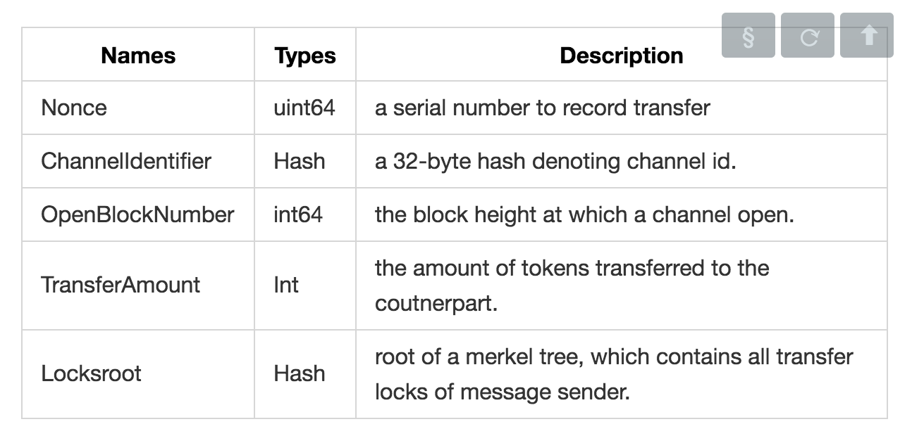
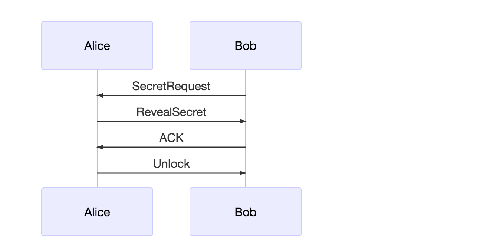
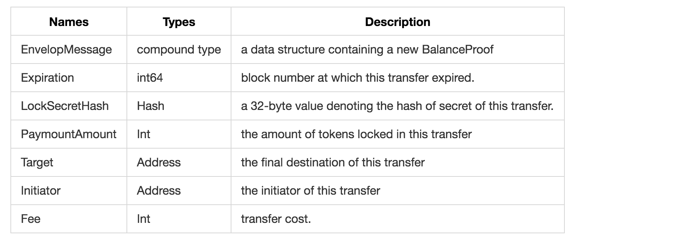

# SmartRaiden Messages Specification
## Overview 
This page primarily introduces SmartRaiden Messages, which is a bunch of data structures used in communication among our off-chain payment channels. Users or Clients can send and receive these messages to claim what they plan to do and present their intention to their transaction partners. 

## Data Structure
### BalanceProof 
BalanceProof is a basic data structure contained in every message that sent or received by a channel participant. Our design principle is once BalanceProof in a message has changed, nonce in that BalanceProof should increase by 1.

**Data Field** : 

### ACK 
ACK is a data structure that our smartraiden messages uses to confirm certain message has been received. It just echoes hash value of that received message. 

**Data Field** : 

### Ping
Ping is a data structure used to test the reachablity of a channel. In which, we just contain a nonce. 

**Data Field** : 

### SecretRequest
SecretRequest is a data structure primarily used when one of participants in a payment channel want to get the secret of a transfer. In this case, he should send a `SecretRequest` to his channel counterpart and make his partner understand that he wishes to get the secret. 

**Data Field** : 

### RevealSecret
RevealSecret is used at the situation that one of participants in a payment channel, once he has received `SecretRequest` from his channel partner, reveals the secret of this transfer to his channel partner. 

**Data Field** : 

### Unlock
Unlock is a data structure we adopt to deal with situations that a participant of a transfer plans to **unlock** the hash lock of this transfer. 

There are two cases for `Unlock` message :

1. Unlock in DirectTransfer

As we can see in DirectTransfer, there is a direct payment channel connecting Alice and Bob. The entire workflow is 
- Once Bob has successfully received Alice's transfer, then he can request for secret of that transfer via `SecretRequest`. 
- As to Alice, once she gets the message that Bob received her transfer safe and sound, certainly Alice will hand her secret to Bob via `RevealSecret`. 
- If there is not any faulty issue occurred during secret transfer, we can guarantee that Bob is about to get the secret from Alice. 
- After Bob received the secret and Alice has received an ACK of Bob, at that time, Alice sends `Unlock` to Bob. 

2. Unlock in MediatedTransfer

As we can view in this MediatedTransfer. We have three participants in this channel, Alice, Bob and Charles. The entire workflow is 

- After Charles has received the transfer from Alice, he wishes to get the secret via `SecretRequest` to Alice.
- Once Alice receives this `SecretRequest`, if there is no problem, then without doubt, Alice will feed this secret to Charles, via `RevealSecret`. 
- As to Charles, when he receives the secret from Alice, to get his deserved money, Charles prepares to reveal secret to his former hop node, Bob, via `RevealSecret`.
- When Bob has received this secret, and after he'd completed verification, he has two choices : 
    - First, If Bob can make sure that Alice is an honest actor and will unlock those money locked in her BalanceProof, Bob immediately send an `Unlock` to Charles to unlock money. But This is not our case.
    - Actually, Bob cannot rely on the virtue of integrity of Alice, so that he will first send a request to Alice to unlock his deserved money locked in Alice's BalanceProof. Once Alice has done that, Bob can ensure his money would not be lost, then he sends `Unlock` to Charles to release his lock. Finally, Charles is able to get those money.  

**Data Field** : 

### RemoveExpiredHashlockTransfer
RemoveExpiredHashlockTransfer is a kind of message and transfer participants primarily adopt it when ongoing transfers get expired for some reason, such as there are one or several mediated nodes disconnect from our token network, or some nodes intentionally stop furthering this transfer to next hop, and causes transfer expiration, etc. 

**Data Field** : 

### DirectTransfer
DirectChannel is the message that mostly used in cases that a direct path exists to link two channel participants. Both just make their transfers sent to their channel counterparts via `DirectTransfer`. `DirectTransfer` can be sent by anyone in this direct payment channel in any times only if this direct channel is still open.

Because in this case we only have two participants : transfer initiator and transfer recipient, so there is no need to lock transfers. 

**Data Field** : 

### MediatedTransfer
MediatedTransfer is the message structure and it is adopted only in cases that a participant has no direct route linking to his transfer recipient. By no means, this participant need resort to other indirect routes so that he can feed his transfer to specific recipient.  

**Data Field** : 

### AnnounceDisposed
AnnounceDisposed is the message that we used in mediate transfer to notify that there are some issues which causes a mediated node has no way to further this transfer.

**Data Field** : 

### AnnounceDisposedResponse
AnnounceDisposedResponse is the message we used when a participant replies to his partner after he/she has received `AnnounceDisposedResponse`. 

**Data Field** : 

### WithdrawRequest
WithdrawRequest is the message that mainly used in cases that a participant wishes to withdraw fund from his channel deposit. But first he needs to notify his partner about his intention and this intention needs to be confirmed by his partner.

**Data Field** : 

### WithdrawResponse
WithdrawResponse is the message that recipient of `WithdrawRequest` has confirmed this message and he assigns his signature within and returns `WithdrawResponse`. 

**Data Field** : 

### SettleRequest
SettleRequest is the message that channel participants adopt when they need CooperativeSettle that payment channel between them. Sender of this `SettleRequest` requests to cooperatively settle the channel. 

**Data Field** : 

### SettleResponse
SettleResponse is the message that channel participants adopt when they just need to confirm the intention and agree with it. When recipient of `SettleRequest` wishes to present that he agrees to cooperatively settle this payment channel, then he just need to reply to his channel pal with this `SettleResponse`. 

**Data Field** : 

